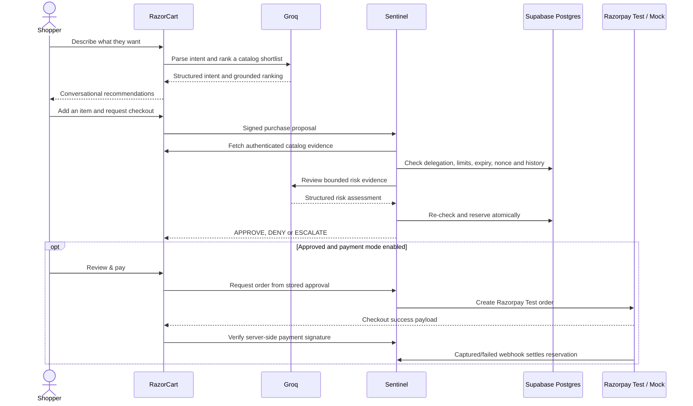

# Know Your Agent — RazorCart + Sentinel

**Sentinel is the protection layer between the AI agent and the payment gateway—allowing an AI buying agent to shop intelligently without being trusted blindly.**

[Open RazorCart](https://razorcart.vercel.app) · [Open Sentinel](https://sentinel-sentinel-a860.vercel.app)


RazorCart and Sentinel are two independent applications built for the Razorpay AI Buildathon. RazorCart helps a shopper discover and choose products. Sentinel decides whether the selected buying agent is actually allowed to make the purchase.

The central idea is simple: **AI can recommend an action, but authority must be verified before money moves.**

## The problem

AI agents are becoming good at understanding requests such as “find me a work laptop under ₹50,000.” The difficult question comes next: should that agent be allowed to spend the user’s money?

A useful authorization layer needs to answer questions such as:

- Is this the agent the user originally delegated authority to?
- Is the product from an allowed category and merchant?
- Is the price the same one the user saw?
- Is the purchase inside the total and per-transaction budgets?
- Has this request already been used?
- Has the delegation expired or been revoked?
- Is the request suspicious enough to need human confirmation?

RazorCart and Sentinel solve this by separating the **buying experience** from the **authorization decision**.

## The solution

| Application | Responsibility |
| --- | --- |
| **RazorCart** | Understand the shopping request, search and rank real products, explain recommendations, manage the cart, and create a signed purchase proposal. |
| **Sentinel** | Authenticate the agent, independently verify the proposal and catalog evidence, enforce delegated limits, return `APPROVE`, `DENY`, or `ESCALATE`, and preserve an audit trail. |

This separation means the storefront cannot quietly grant itself more authority. The same cart can receive different decisions when it is submitted by two agents with different delegations.

## How it works



### AI recommends; policy decides

Groq is used for natural-language understanding, product ranking, grounded conversational responses, and bounded risk reasoning. It cannot approve a payment, change a budget, issue a signing credential, or bypass a failed rule.

Budget, category, merchant, expiry, frequency, price-integrity, signature, and replay checks are deterministic. If AI reasoning is unavailable or uncertain, Sentinel fails safely by escalating instead of silently approving.

## What is included

### RazorCart — AI storefront and buying agent

- Conversational shopping assistant with multi-turn context
- Structured intent parsing for category, budget, attributes, and use case
- Database pre-filtering followed by Groq relevance ranking
- Explanations grounded only in stored product fields
- Clarifying questions for ambiguous requests
- Smart closest-alternative responses when no exact match exists
- Real multi-category catalog and hosted product photography from DummyJSON
- Persistent cart CRUD and totals
- Multiple independently configured buying agents
- Per-agent spending, category, merchant, count, frequency, and expiry limits
- Server-generated purchase proposals; browser prices are never trusted
- Demo controls for tampering, replay, budget breach, and merchant mismatch
- AI-action and authorization audit viewer
- Responsive editorial interface with designed loading, empty, error, and 404 states

### Sentinel — independent authorization service

- HMAC-SHA256 agent authentication over canonical JSON
- Per-agent signing credentials generated server-side and returned only once
- Encrypted signing credentials at rest
- Global request-ID replay protection
- Independent authenticated catalog verification
- Total-budget and per-transaction enforcement
- Transaction-count and rolling-frequency enforcement
- Category and merchant allowlists
- Delegation expiry, policy revision, and revocation checks
- Atomic authorization and budget reservation in PostgreSQL
- `APPROVE`, `DENY`, and `ESCALATE` verdicts with machine-readable reasons
- Short-lived authorization artifacts bound to the exact proposal
- Append-only decision and audit history
- Supabase Auth console with administrator and agent-scoped access
- Razorpay Standard Checkout in Test Mode after Sentinel approval; live credentials are refused

## Demo scenarios

RazorCart contains deliberate demo controls so the safety boundary can be shown live instead of described only in slides.

| Scenario | What RazorCart sends | Expected Sentinel behavior |
| --- | --- | --- |
| **Normal** | The proposal exactly as shown to the shopper | Approve when every delegated rule passes |
| **Price tampering** | A price different from the trusted catalog | Deny with a catalog-price mismatch |
| **Replay** | A previously used `request_id` | Deny as a duplicate request |
| **Budget breach** | An amount above the agent’s limit | Deny for exceeding delegated authority |
| **Merchant mismatch** | A merchant outside the allowlist | Deny for merchant scope violation |
| **Cross-agent isolation** | The same cart submitted by two agents | Produce separate decisions from each agent’s limits |
| **Near a safety boundary** | A valid but high-risk request | Escalate for additional confirmation |

## Five-minute demo path

1. Open [RazorCart](https://razorcart.vercel.app) and ask the shopping desk for a product using normal language.
2. Refine the request in a follow-up message to demonstrate conversational context.
3. Add a recommendation to the cart and select an active buying agent.
4. Submit the checkout in **Normal** mode and inspect Sentinel’s verdict and checks.
5. Repeat with **Price tampering**, **Replay**, or **Merchant mismatch**.
6. Switch to an agent with a smaller budget or narrower category scope and retry the same cart.
7. Open [Sentinel](https://sentinel-sentinel-a860.vercel.app) to inspect the agent registry, decision feed, and audit trail.

The Sentinel operations console requires a confirmed Supabase Auth account. Administrator access is assigned through protected `app_metadata`; administrator credentials are intentionally not stored in this repository.

## Purchase proposal contract

RazorCart generates a fresh server-side proposal for each purchase attempt. A simplified example is shown below:

```json
{
  "request_id": "req_88213",
  "agent_id": "razorcart-buyer-01",
  "merchant": "razorcart-demo-store",
  "product_name": "Example Laptop",
  "sku": "LAP-EXAMPLE-01",
  "quantity": 1,
  "price": 42999,
  "currency": "INR",
  "category": "laptops",
  "delivery_address": "Redacted before audit storage"
}
```

Sentinel does not treat product names, prices, or merchant claims in this object as trusted evidence. It fetches the matching catalog record independently before authorizing the request.

## Technology stack

| Layer | Technology |
| --- | --- |
| Frontend | React 19, TypeScript, Vite, Tailwind CSS |
| Interaction | Framer Motion, GSAP, Lenis, Radix primitives, cmdk |
| Forms and validation | React Hook Form, Zod |
| Backend | Node.js, Express 5, TypeScript |
| Database | Supabase PostgreSQL, Prisma ORM |
| Authentication | Supabase Auth |
| AI | Groq SDK with an OpenAI-compatible structured-output workflow |
| Product source | DummyJSON Products API |
| Authorization signing | HMAC-SHA256 over canonical JSON |
| Payment boundary | Local mock mode or Razorpay Test Mode only |
| Hosting | Vercel |

## Repository layout

```text
.
├── razorcart/            # Storefront, shopping assistant and buying-agent API
│   ├── prisma/           # Catalog, cart, delegation and audit schema
│   ├── server/           # Express API, Groq pipeline and Sentinel bridge
│   ├── scripts/          # Demo reset and agent synchronization
│   └── src/              # React storefront and feature modules
├── sentinel/             # Independent authorization service and console
│   ├── prisma/           # Authorization, budget, nonce and audit schema
│   ├── server/           # Policy engine, risk reasoning and payment adapter
│   ├── scripts/          # Setup, database checks and demo scenarios
│   └── src/              # React operations console
└── README.md
```

The applications use separate `razorcart` and `sentinel` PostgreSQL schemas. Sentinel’s authorization tables are not exposed through the browser-facing Supabase Data API.

## Run locally

### Prerequisites

- Node.js 22 or newer
- A Supabase project with PostgreSQL and email/password Auth enabled
- A Groq API key for live AI behavior
- Optional Razorpay **test** credentials if testing the payment adapter

### 1. Clone the repository

```bash
git clone https://github.com/AdityaJswl/Sentinel.git
cd Sentinel
```

### 2. Collect the Supabase settings

From the Supabase project, collect:

- Transaction-pooler connection URL on port `6543`
- Session/direct connection URL on port `5432`
- Project URL
- Publishable key

Use URL-encoded database passwords. Configure the RazorCart URLs with `schema=razorcart` and Sentinel URLs with `schema=sentinel`. Never place database URLs or server secrets in frontend variables.

Add the local and deployed Sentinel origins to the Supabase Auth redirect allowlist. For local development, include `http://127.0.0.1:5175`.

### 3. Configure Sentinel

Install dependencies:

```bash
cd sentinel
npm install
```

Create an ignored `sentinel/.env.local` containing the database connection URLs and public Supabase settings. Add `GROQ_API_KEY` there or to the private `sentinel/.env` generated by setup.

Required configuration names:

```env
DATABASE_URL="<SENTINEL_TRANSACTION_POOLER_URL>"
DIRECT_URL="<SENTINEL_SESSION_OR_DIRECT_URL>"
VITE_SUPABASE_URL="<SUPABASE_PROJECT_URL>"
VITE_SUPABASE_PUBLISHABLE_KEY="<SUPABASE_PUBLISHABLE_KEY>"
GROQ_API_KEY="<GROQ_API_KEY>"
```

Then generate private signing credentials and apply the Sentinel migrations:

```bash
npm run setup
```

`npm run setup` creates private random signing, registration, and catalog credentials when they do not already exist. It never prints those credentials.

### 4. Configure RazorCart

In a second terminal:

```bash
cd razorcart
npm install
cp .env.example .env
```

Set `DATABASE_URL`, `DIRECT_URL`, and `GROQ_API_KEY` in the private `razorcart/.env`. Both database URLs must target the RazorCart schema.

Connect the local services without copying credentials by hand:

```bash
cd ../sentinel
npm run connect:razorcart
```

Apply the RazorCart migration and seed the catalog:

```bash
cd ../razorcart
npm run db:setup
```

The seed script discovers and imports the current DummyJSON catalog in pages, validates every product, and keeps the last successful catalog if the upstream API is temporarily unavailable.

### 5. Start both applications

Terminal 1:

```bash
cd sentinel
npm run dev
```

Terminal 2:

```bash
cd razorcart
npm run sentinel:sync
npm run dev
```

Local addresses:

- RazorCart UI: `http://127.0.0.1:5174`
- RazorCart API: `http://127.0.0.1:3002`
- Sentinel console: `http://127.0.0.1:5175`
- Sentinel API: `http://127.0.0.1:3003`

## Environment-variable guide

Only variable names and their purposes are documented here. Real values must stay in ignored local files or encrypted deployment settings.

### RazorCart

| Variable | Purpose |
| --- | --- |
| `DATABASE_URL` | Supabase transaction-pooler URL for the RazorCart schema |
| `DIRECT_URL` | Direct/session database URL for migrations and seeding |
| `GROQ_API_KEY` | Server-only Groq credential |
| `GROQ_MODEL` | Configurable Groq model name |
| `SENTINEL_URL` | Sentinel authorization endpoint; blank uses the local mock |
| `SENTINEL_REGISTRATION_KEY` | Server-only privileged registration credential |
| `SENTINEL_CATALOG_KEY` | Shared server credential for catalog evidence |
| `RAZORCART_ADMIN_KEY` | Protects RazorCart’s delegation-management route |
| `SENTINEL_CREDENTIAL_KEY` | Encrypts agent signing credentials stored by RazorCart |
| `VITE_RAZORPAY_KEY_ID` | Public Razorpay Test Mode key ID used to open Checkout |
| `DEMO_MODE` | Enables clearly labelled corruption controls |

### Sentinel

| Variable | Purpose |
| --- | --- |
| `DATABASE_URL` | Supabase transaction-pooler URL for the Sentinel schema |
| `DIRECT_URL` | Direct/session database URL for migrations |
| `SIGNING_SECRET` | Encrypts and signs Sentinel-issued artifacts |
| `REGISTRATION_API_KEY` | Protects server-to-server agent registration |
| `VITE_SUPABASE_URL` | Public Supabase project URL used by Auth |
| `VITE_SUPABASE_PUBLISHABLE_KEY` | Public Supabase browser key used by Auth |
| `GROQ_API_KEY` | Server-only Groq credential for risk reasoning |
| `RAZORCART_CATALOG_URL` | Trusted merchant catalog-evidence endpoint |
| `SENTINEL_CATALOG_KEY` | Authenticates catalog-evidence requests |
| `PAYMENT_MODE` | `mock` by default; `test` enables Razorpay Test Mode |
| `RAZORPAY_KEY_ID` | Optional Razorpay test key ID |
| `RAZORPAY_KEY_SECRET` | Optional server-only Razorpay test secret |
| `RAZORPAY_WEBHOOK_SECRET` | Webhook-verification secret; required to reconcile captured Test Mode payments |

## Security design

1. **The browser is not trusted.** Catalog prices and authorization totals are reconstructed or verified server-side.
2. **Each agent has its own authority.** Budgets and scopes belong to an agent delegation, not to the storefront globally.
3. **Every request is signed.** Sentinel authenticates the exact canonical proposal before evaluating it.
4. **Replay protection is global.** A request ID is claimed atomically and cannot be reused by another agent.
5. **Catalog evidence is independent.** Sentinel fetches the merchant’s record through an authenticated server-to-server route.
6. **Hard rules are deterministic.** An LLM cannot override a failed signature, budget, scope, expiry, or replay check.
7. **Authorization is transactional.** Sentinel re-checks policy while holding the owning agent’s database row lock before reserving budget.
8. **Artifacts are narrowly bound.** An approval artifact is short-lived, single-use, and tied to the exact agent, merchant, items, amount, and policy revision.
9. **Secrets stay server-side.** Groq, database, registration, signing, and payment credentials never enter the Vite client bundle.
10. **Console access is scoped.** Administrators can inspect all agents; standard users can only inspect their assigned agent.

## Verification

Run each project’s checks independently:

```bash
cd razorcart
npm test
npm run lint
npm run build

cd ../sentinel
npm test
npm run lint
npm run build
```

Sentinel’s PostgreSQL integration tests require a dedicated non-production `TEST_DATABASE_URL`:

```bash
cd sentinel
npm run test:integration
```

The integration suite creates an isolated temporary schema and removes only that generated schema after the run.

## Deployment

Both applications include Vercel configuration and are deployed separately:

- [RazorCart production deployment](https://razorcart.vercel.app)
- [Sentinel production deployment](https://sentinel-sentinel-a860.vercel.app)

Production deployment requires the same server-only environment variables in the corresponding Vercel project. Database migrations and catalog seeding must be run against Supabase before deployment. Secrets must never be committed to Git.

For end-to-end Razorpay Test Mode settlement, add a Razorpay Dashboard webhook for `payment.captured` and `payment.failed` at `https://sentinel-sentinel-a860.vercel.app/webhooks/razorpay`. Store the same webhook secret in Sentinel as `RAZORPAY_WEBHOOK_SECRET`, then redeploy Sentinel. RazorCart's checkout success callback is verified server-side, but the webhook is the independent confirmation that turns a reserved authorization into settled spend.

## Current scope

- Payment mode is `mock` by default.
- Razorpay integration is restricted to Test Mode; live key IDs are rejected.
- No real payment credentials or administrator credentials are included.
- The project demonstrates authorization, tamper detection, isolation, auditability, and a safe payment-provider boundary; it is not presented as a licensed production payment processor.

## Data and services

- Product catalog: [DummyJSON Products API](https://dummyjson.com/products)
- AI inference: [Groq](https://groq.com/)
- Database and authentication: [Supabase](https://supabase.com/)
- Test payment-provider boundary: [Razorpay](https://razorpay.com/)

---

Built for the Razorpay AI Buildathon with one principle: **a buying agent may propose, but authority must be proven before action.**
